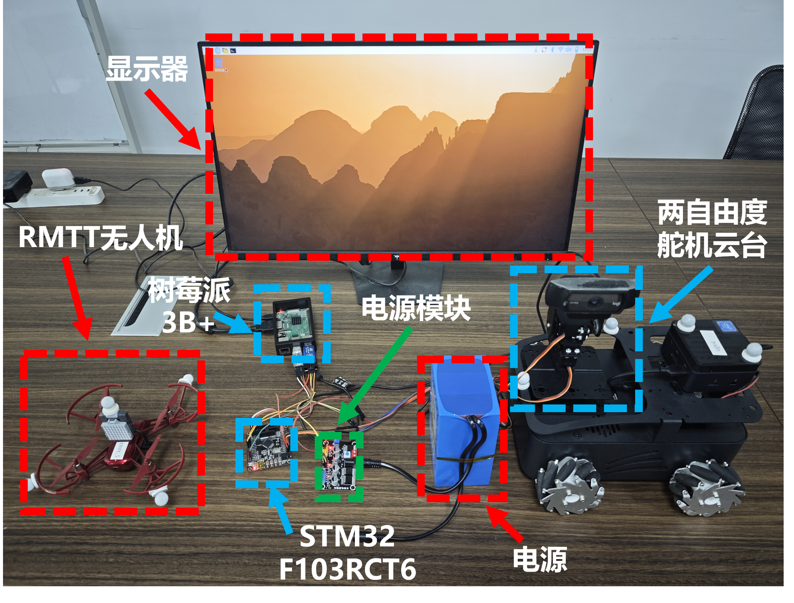

# Embedded Vision Servo Tracking System

基于 **Raspberry Pi 3B+ + STM32F103RCT6** 的嵌入式视觉伺服追踪系统，实现无人机目标检测、多传感器状态感知与双自由度云台闭环追踪。

## 📷 System Prototype

<p align="center">
  
</p>

## 🏗️ System Architecture

```text
USB Camera
    │
    ▼
Raspberry Pi 3B+
├── OpenCV Image Capture
├── YOLOv11 Detection
└── Target Pixel Error
    │
    │ USART
    ▼
STM32F103RCT6
├── I²C ── MPU6050  → Acceleration / Angular Velocity
├── I²C ── VL53L0X  → Target Distance
└── PWM ── MG996R ×2
              │
              ▼
        2-DOF Gimbal
```

系统形成 **视觉偏差 + 运动状态 + 目标距离** 的联合感知，并由 STM32 完成云台实时控制。

## 🔧 Hardware

| Module | Model | Function |
|---|---|---|
| Vision Computer | Raspberry Pi 3B+ | 图像处理与目标检测 |
| MCU | STM32F103RCT6 | 传感器采集与实时控制 |
| Camera | USB Camera | 图像采集 |
| IMU | MPU6050 | 加速度、角速度采集 |
| ToF Sensor | VL53L0X | 近距离测距 |
| Servo | MG996R ×2 | Pan/Tilt 云台控制 |

## ⚙️ Core Functions

- **YOLOv11 Detection**：完成无人机目标检测与目标中心定位
- **Visual Servoing**：根据目标中心与图像中心偏差控制云台
- **MPU6050**：获取载体角速度与加速度，提供运动状态信息
- **VL53L0X**：补充单目视觉缺失的近距离深度信息
- **USART Communication**：实现 Raspberry Pi 与 STM32 数据交互
- **Gimbal Control**：STM32 通过 PWM 控制两路 MG996R
- **Filtering & Control**：采用滤波、控制死区及角度增量限幅改善跟踪稳定性

## 📊 Performance

| Metric | Result |
|---|---:|
| Detection FPS | 12 → **25 FPS** |
| Control Latency | 180 → **54 ms** |
| Tracking RMSE | **↓ ~57%** |
| Communication Error Rate | 0.13% → **0.01%** |

## 📁 Repository

```text
├── raspberry_pi/       # YOLOv11、图像采集、串口通信
├── stm32/              # STM32F103RCT6 固件
├── docs/               # 系统文档与图片
├── results/            # 实验结果
├── README.md
└── LICENSE
```

## 🛠️ Tech Stack

`Raspberry Pi` `STM32` `C/C++` `Python` `OpenCV` `YOLOv11`  
`I²C` `USART` `PWM` `MPU6050` `VL53L0X` `Visual Servoing`


## 📄 License

This project is licensed under the [MIT License](LICENSE).
